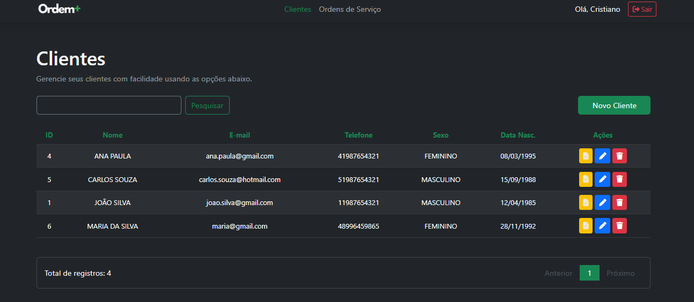
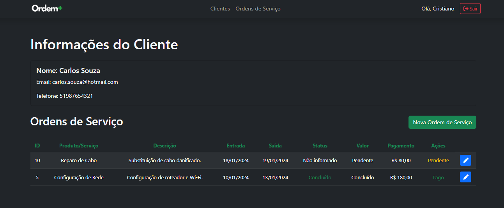
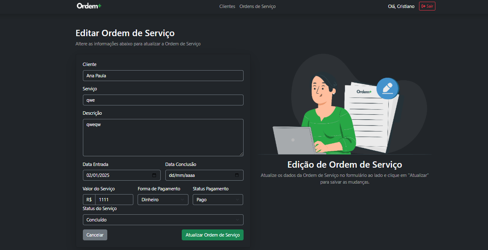

# Sistema de Gerenciamento de Ordens de Serviço

Este é um projeto desenvolvido para a disciplina de **Web 1** com o objetivo de criar uma aplicação PHP integrada com banco de dados. O sistema implementado permite o gerenciamento de ordens de serviço, incluindo funcionalidades como cadastro de usuários, login, e gerenciamento de clientes e ordens de serviço.

## Funcionalidades
- **Cadastro de Usuários**: Registre novos usuários no sistema.
- **Login de Usuários**: Autenticação segura utilizando sessões PHP e criptografia de senhas.
- 
- **Gerenciamento de Clientes**: Adicione, edite, visualize e exclua informações de clientes.
- 
- **Gerenciamento de Ordens de Serviço**: Cadastre, edite, visualize e gerencie ordens de serviço.
- 
- 

### Linguagem de Programação: 


### Banco de Dados: 


### Frontend: 


### Outros: 


## Estrutura do Projeto
- **/db**: Scripts de conexão com o banco de dados.
- **/pages**: Módulos para funcionalidades específicas (clientes, ordens de serviço, etc.).
- **/css**: Estilos personalizados da aplicação.
- **/img**: Imagens utilizadas na aplicação.
- **/index.php**: Página principal da aplicação.
- **/login.php**: Página de login.

## Instalação
1. Clone este repositório:
   ```bash
   git clone https://github.com/seu-usuario/sistema-ordens-servico.git
